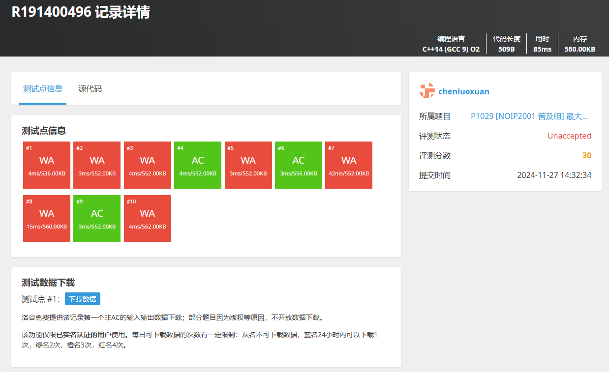

# 项目背景

> 还记得大一被PTA毒打的日子么

实际上，PTA就是一种OnlineJudge系统。从概念上定义，它是一个**在线判题系统**，能够对用户提交的多种程序源代码进行编译执行，并根据预先存储的结果进行校验后得到源程序的正确性。

OnlineJudge系统最初使用于XCPC比赛中，随着国内计算机行业的不断发展，许多高校开发了属于自己的OnlineJudge系统(如POJ、HDUOJ等)，同时计算机行业也开发了OnlineJudge系统服务于个人或他人(Leetcode、牛客等)。现在OnlineJudge系统不仅在比赛中使用，还在教学、考试、程序上机实践中使用，极大提高了教学工作效率和方便了各类编程人员。&#x20;

<figure><figcaption>
PTA图片
</figcaption></figure>

## **为什么要有OnlineJudge?**

### **编程教育的时代需求**

随着信息技术的快速发展，编程已经成为一项核心的数字化技能，编程教育不仅是计算机专业学生的核心课程之一，也是非计算机学科学生提升逻辑思维与解决问题能力的重要手段。然而，传统的编程教育模式在以下几个方面存在明显的不足：

* **实践不足**：理论课程注重知识点讲解，但缺乏系统化的实践环节，学生难以在真实的编程环境中验证所学知识。
* **缺乏即时反馈**：在传统课堂上，学生在编程过程中遇到问题时无法得到及时、个性化的指导，往往需要等待教师批改作业或课堂答疑。
* **个性化支持欠缺**：学生的学习基础和进度不尽相同，统一的教学模式难以满足所有学生的需求，部分学生容易掉队。

在此背景下，代码在线评测系统（Online Judge, OJ）作为一种编程实践的重要工具，能够通过实时的代码评测和反馈，帮助学生有效掌握编程技能。然而，传统的 OJ 系统存在架构单一、扩展性差和评测功能有限等问题，难以满足现代化教育的需求。

### **现有代码评测系统的不足**

目前市场上的 OJ 系统多基于单体架构，功能模块高度耦合，难以应对大规模用户访问和复杂的教学需求。具体问题包括：

* **并发性能瓶颈**：传统单体架构的 OJ 系统在处理大量并发代码提交时，容易出现评测延迟、系统响应慢甚至宕机等问题。
* **功能单一**：OJ系统通常由比赛系统改造而来，因此评测功能通常仅限于通过与否的判断，缺乏针对代码优化、算法复杂度分析和编程习惯改进的深度反馈。
* **缺乏智能辅导**：对初学者而言，仅仅知道代码是否通过测试用例是不够的，他们需要了解错误原因、改进建议以及代码的最佳实现方式。

<figure><figcaption>
如图所示，传统OJ通常只会说正确与否，但不会对你的代码进行进一步审查与提出建议
</figcaption></figure>

这些问题限制了 OJ 系统在教育领域的深入应用，也暴露出其在满足大规模教学需求方面的局限性。

## **我们能做什么？**

随着云计算、容器化技术和人工智能（AI）的快速发展，构建新一代智能化的 OJ 系统成为可能：

* **微服务架构的成熟**：微服务架构能够将系统功能拆分为多个独立模块，如用户管理、题目管理、评测引擎等，使得系统更加灵活、高效且易于扩展。
* **容器化技术的普及**：如 Docker 和 Kubernetes，可以为代码评测提供安全隔离的运行环境，解决传统沙箱的资源管理和安全性问题。
* **大语言模型（LLM）的突破**：如 GPT 系列模型，能够实现代码的智能生成、优化和错误分析，为初学者提供个性化的学习支持。

这些技术的发展为 OJ 系统的升级提供了全新的解决方案，使得构建安全、高效、智能化的编程教育平台成为可能。

## **项目的目标与意义**

针对上述问题，本项目旨在开发一个基于现代技术栈的代码在线评测系统，结合微服务架构、容器化技术和大语言模型（LLM），以全面提升编程教育的效果和体验：

1. **支持多语言编程评测**：构建高性能的评测引擎，支持 Python、Java、C++ 等多种编程语言，满足不同课程和学习需求。
2. **提供即时且多维度的反馈**：通过自动化评测和智能分析，不仅告诉学生“对”与“错”，还帮助他们优化代码、改进算法和提升编程习惯。
3. **实现个性化学习路径**：通过 LLM 技术和知识库微调，提供个性化的辅导和学习建议，帮助学生以自己的节奏掌握编程技能。
4. **提升系统的扩展性与稳定性**：通过微服务架构和 Docker 容器化，解决传统系统的性能瓶颈问题，支持大规模并发访问和多用户在线评测。
5. **赋能教师的教学管理**：提供教师后台管理功能，包括学生进度跟踪、作业批量布置、智能评估和学习数据分析，帮助教师提升教学效率。

## **项目的应用场景**

本项目的应用场景涵盖多个方面：

* **高校编程课程**：支持计算机科学专业及相关课程（如算法设计、数据结构）的在线编程实践和评测。
* **在线编程训练平台**：为广大学生和程序员提供一个可靠的编程练习环境。
* **企业培训与技能提升**：支持企业为员工提供编程技能培训，快速掌握关键技术。
* **编程竞赛与挑战**：为各种规模的编程比赛提供高效的评测引擎和安全的运行环境。

## **项目的重要性**

通过本项目的实施，我们将尝试建立我们学校的BNUZH OJ，努力解决传统 OJ 系统在扩展性、智能性和用户体验上的痛点，推动编程教育迈向新高度。同时，通过先进技术的结合（如大语言模型和容器化技术），为编程教育的智能化和普及化提供示范效应，助力培养未来的科技人才。
